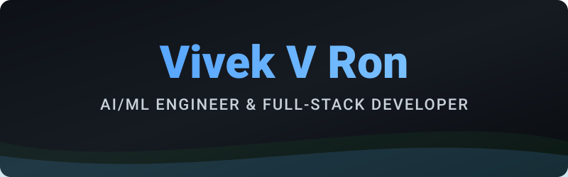
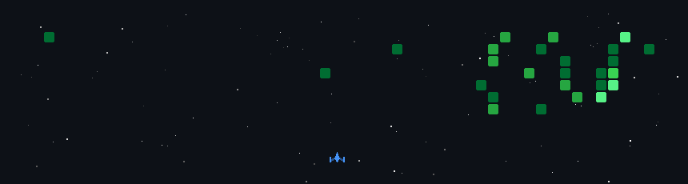

  
  
   
  
  
  

    
    
    
    
    
  

  

    <em>Based in Hubli &bull; Living in Bengaluru</em>
  

---

### 🚀 About Me

I am a Software Developer with hands-on experience building production-quality full-stack applications using **Java**, **Spring Boot**, and **React**. I specialize in designing scalable enterprise backend systems, working with cloud platforms (GCP), and applying Machine Learning to solve real-world problems.

- 🔬 **Research:** Author of two IEEE conference papers (currently under peer review) focusing on Multimodal RAG architectures and automated waste sorting via CNN/YOLO.
- 💻 **Currently Building:** High-performance web apps, AI decision-support systems, and enterprise backend platforms.
- 🌐 **Portfolio:** Check out my [Interactive 3D Portfolio](https://vivek-v-ron.vercel.app) for a deeper dive into my work.

---

### 🛠️ Tech Stack

  <!-- AI / ML Stack -->
  
  
  
  
  
  
  
   
   
  <!-- Full-Stack & Cloud -->
  
  
  
  
  
  
  
  
  

---

### 🔥 Featured Projects

#### [Context-Aware Candidate Ranking Pipeline](https://github.com/VIVEKVRON/india-ai-hiring-challenge)
> **RAG, ML, DL, FastAPI, Vector DB (Qdrant)**  
Engineered a Two-Stage Hybrid AI architecture replacing boolean ATS keyword filters with a mathematically grounded semantic search system. Architected a broad dense retrieval infrastructure (bge-m3 Bi-Encoder) and deployed a Qwen3-Reranker-0.6B Cross-Encoder to parse and embed 10,000+ candidate profiles into a highly searchable vector space.

#### [AGRIBOT: Multimodal RAG Platform](https://github.com/VIVEKVRON/AgriBot-Smart-Farming)
> **Python, RAG Architecture, Vector DB, FastAPI, React**  
A multimodal AI decision-support system featuring vector search, contextual LLM inference, and low-latency API integration for precision agriculture.

#### [Elite Task Manager](https://github.com/VIVEKVRON/elite-task-manager)
> **Java, Spring Boot 3, Spring Security, PostgreSQL, React**  
A scalable enterprise task platform built with robust MVC patterns, Spring Security authentication, and optimized database transactions.

#### [CarbonTrack Analytics Platform](https://github.com/VIVEKVRON/carbon-tracker)
> **React 19, Spring Boot, REST APIs, GCP**  
Gamified carbon accounting platform with predictive footprint analytics and real-time metrics tracking.

---

### 🎮 Contributions

  

---

### 📊 GitHub Stats

  
   
   
  

 

  <i>"Transforming complexity into seamless digital experiences."</i>

