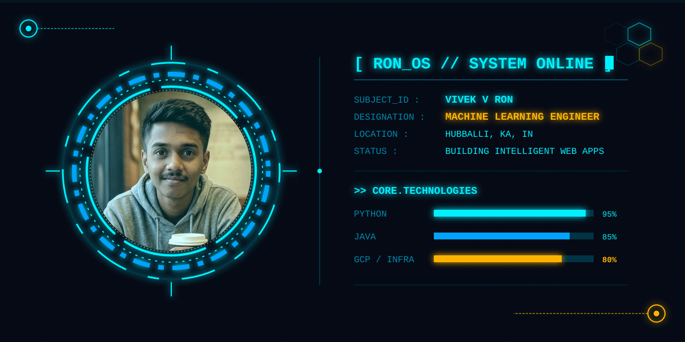

  

> **[ SYSTEM DIRECTIVE ]** Software developer specializing in building production-quality full-stack applications and scalable backend systems. Published ML researcher with hands-on experience in Deep Learning and RAG architectures. Certified by Amazon & Google. Eager to contribute to impactful products.

### 📊 TACTICAL READOUT

  
  

### ⚡ ENERGY GRID (CONTRIBUTIONS)

  <picture>
    <source media="(prefers-color-scheme: dark)" srcset="https://raw.githubusercontent.com/VIVEKVRON/VIVEKVRON/output/github-contribution-grid-snake.svg">
    <source media="(prefers-color-scheme: light)" srcset="https://raw.githubusercontent.com/VIVEKVRON/VIVEKVRON/output/github-contribution-grid-snake.svg">
    
  </picture>

### 🛠️ CORE TECHNOLOGIES

  
  
  
  
  
  
  
  

### 📂 ACTIVE PROTOCOLS (PROJECTS)

| Project | Designation | Description |
| :--- | :--- | :--- |
| **AgriBot** | Hybrid AI | Multimodal precision agriculture decision support integrating DL and RAG pipelines. (IEEE paper under review) |
| **Elite Task Manager** | Full-Stack | Task management app with clean MVC architecture, RESTful APIs, and real-time state. |
| **CarbonTrack** | Full-Stack | Gamified footprint tracker with React 19 frontend and Spring Boot backend. |
| **Candidate Ranking** | AI / NLP | Two-stage hybrid AI architecture for semantic search and candidate ranking. |
| **Library System** | JavaFX | Desktop application for managing library inventory with real-time tracking. |

### 🔬 RESEARCH LAB

* **Performance and Efficiency Trade-offs in Automated Waste Sorting between CNN and YOLO** (IEEE Conference - Under Review)
* **AgriBot: A Hybrid Multimodal Architecture Integrating Deep Learning and RAG for Precision Agriculture** (IEEE Conference - Under Review)

### 🔗 COMM LINKS

